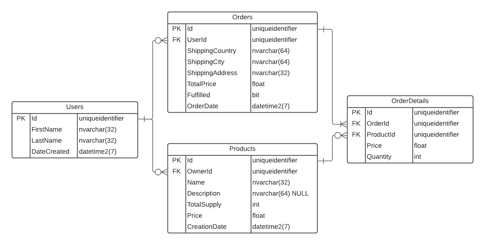

# Alibabooow - An e-commerce Rest API
A very small e-commerce Rest API project, built for demonstrating the greatness of DTOs (Data Transfer Objects).

 

## Technologies
* C# 10
* .NET 6
* ASP.NET Core API
* Entity Framework Core with SqlServer as Database Provider

## Try the API
You can try out the API using [Postman](https://www.postman.com/downloads/).  
Press **Import** to import a collection and then you can use either this [collection file](./Alibabooow.Api.postman_collection.json) or the following Link: `https://www.getpostman.com/collections/9bb4034d18f17d9082e7`

---

### ER-Diagram

